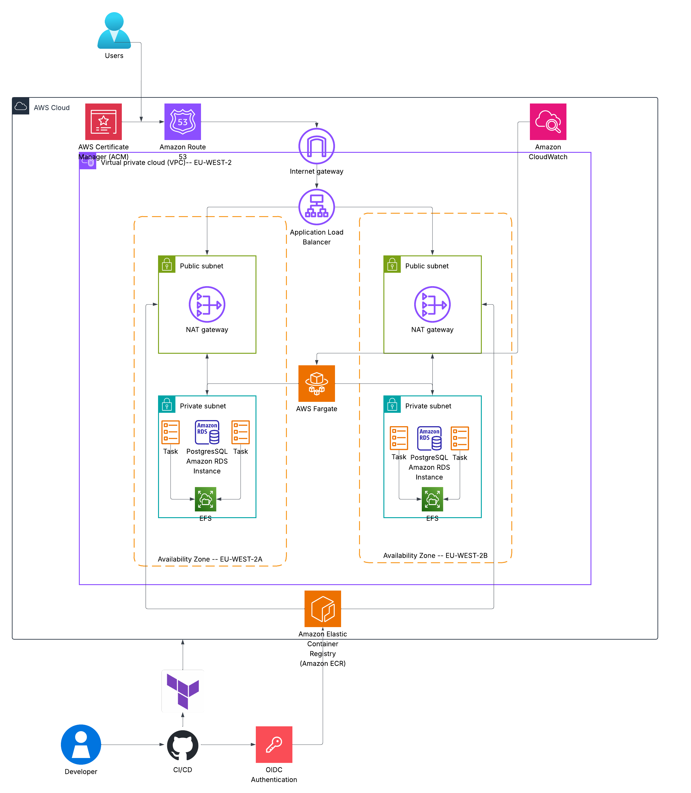

# Airport Flight Management System (AFMS)

<p align="center">
	
</p>

<p align="center">
	<strong>Live airport operations dashboard for flight tracking, management, and search.</strong>
</p>

<p align="center">
	
	
	
	
</p>

## Table of contents

- [Overview](#overview)
- [Visual tour](#visual-tour)
- [What this repository contains](#what-this-repository-contains)
- [Key features](#key-features)
- [Tech stack](#tech-stack)
- [Application architecture overview](#application-architecture-overview)
- [Architecture diagram](#architecture-diagram)
- [Prerequisites](#prerequisites)
- [Configuration](#configuration)
- [Running locally](#running-locally)
- [Running tests](#running-tests)
- [Docker](#docker)
- [Infrastructure (Terraform)](#infrastructure-terraform)
- [Automation & CI/CD](#automation--cicd)
- [Security notes](#security-notes)
- [Operational notes](#operational-notes)
- [Coursework context](#coursework-context)

## Overview

AFMS is a flight management dashboard built for airports and flight operations teams. It allows users to view real-time flight information, search for specific flights, manually add or edit flight details, and receive live updates as flight statuses change.

The system pulls live flight data from the AeroDataBox service but also allows teams to make their own adjustments and overrides—ensuring that critical manual edits are never lost when new data arrives.

Behind the scenes, AFMS is built on ASP.NET Core MVC, with a database backend and live notifications powered by SignalR.

## Visual tour

### Main product flows

- Secure login for operational staff
- Real-time dashboard for live airport traffic
- Manual add/edit workflow for managed flights
- Flight details administration and advanced search

### Screenshots

#### Login


#### Dashboard


#### Add Flight


#### Flight Details


#### Flight Details (Extended List)


#### Advanced Search


## What this repository contains

- `AFMS/`: main web application (`net10.0`)
- `AFMS.Tests/`: unit tests (xUnit)
- `Terraform/`: AWS infrastructure as code (VPC, ECS, ALB, RDS, Route53)
- `docs/`: project documentation folder

## Key features

- Live flight retrieval from AeroDataBox (RapidAPI)
- Background sync service (every 2 minutes)
- Manual Add/Edit/Delete flight workflow
- Manual-flight overlay so user-edited fields are not overwritten by API sync
- Advanced Search with filters, sorting, and pagination
- AI-assisted parsing for:
	- search filters (`/Home/ProcessAIQuery`)
	- add-flight form filling (`/Home/ProcessAddFlightQuery`)
- JWT authentication stored in an HTTP-only cookie
- SignalR hub for client updates (`/flightHub`)
- Health endpoint (`/health`)

## Tech stack

- C# / ASP.NET Core MVC
- Entity Framework Core
	- SQLite by default
	- PostgreSQL when connection string uses `Host=`
- SignalR
- JWT bearer authentication
- xUnit for tests
- Docker for containerised runtime
- Terraform for AWS deployment

## Application architecture overview

- `Program.cs` wires up authentication, authorisation, DB provider selection, services, SignalR, and startup DB checks.
- `HomeController` drives dashboard, advanced search, and AI-assisted endpoints.
- `FlightController` handles manual flight CRUD and UTC normalisation for form times.
- `AccountController` manages login/logout and JWT token issuance.
- `AeroDataBoxService` fetches and normalises external API data.
- `FlightSyncService` syncs API flights into DB and broadcasts deltas.
- `ManualFlightMergeService` applies manual overrides and creates synthetic rows when needed.
- `FlightSearchService` performs advanced search filtering/sorting/pagination.
- `FlightDetailsService` centralises details-page formatting and validation helpers.

## Architecture diagram



## Prerequisites

- .NET 10 SDK
- Docker (optional, for container workflow)
- AeroDataBox RapidAPI key (required for live data)
- DeepSeek API key (optional if AI assistant features are used)

## Configuration

Main config sources:

- `AFMS/appsettings.json`
- environment variables
- `.env` file in `AFMS/` (and parent fallback), loaded at startup

Use `AFMS/.env.example` as your starting point.

### Important environment variables

- `AERODATABOX_API_KEY`
- `AERODATABOX_API_HOST`
- `DEFAULT_AIRPORT`
- `DEEPSEEK_API_KEY`
- `DEEPSEEK_API_ENDPOINT`
- `DEEPSEEK_MODEL`
- `DEEPSEEK_TIMEOUT_SECONDS`
- `DEEPSEEK_MAX_REQUESTS_PER_MINUTE`
- `DEEPSEEK_PROMPT_FILE`
- `AUTH_ADMIN_USERNAME`
- `AUTH_ADMIN_PASSWORD`
- `AUTH_JWT_SECRET`
- `AUTH_ISSUER`
- `AUTH_AUDIENCE`
- `AUTH_TOKEN_EXPIRY_HOURS`
- `DATA_PROTECTION_KEYS_PATH` (recommended for multi-instance/container deployment)

## Running locally

From repository root:

```bash
dotnet restore AFMS.sln
dotnet run --project AFMS/AFMS.csproj
```

Default local launch profile URLs are in `AFMS/Properties/launchSettings.json`.

## Running tests

From repository root:

```bash
dotnet test AFMS.Tests/AFMS.Tests.csproj
```

Current tests focus on `ManualFlightMergeService` behaviour.

## Docker

Application Docker assets live in `AFMS/`.

```bash
cd AFMS
docker compose up --build
```

Container runs on port `8080`.

## Infrastructure (Terraform)

Terraform configuration is under `Terraform/` and composes the following AWS services:

- **VPC** (Virtual Private Cloud): Creates an isolated network environment, defining subnets and routes for secure communication.
- **ECS** (Elastic Container Service): Container orchestration service that runs the AFMS application in Docker containers across multiple instances, with auto-scaling support.
- **ALB** (Application Load Balancer): Routes incoming HTTP/HTTPS traffic to healthy ECS tasks, enabling high availability and zero-downtime deployments.
- **RDS** (Relational Database Service): Managed PostgreSQL database, handling persistence for flights, users, and application state.
- **Route53**: AWS DNS service that routes domain requests to the ALB, providing a stable endpoint for users.

All infrastructure is provisioned in the `eu-west-2` (London) region. Terraform state is stored in S3 for team collaboration.


### Before applying Terraform

Review and customise:

- Backend configuration in `provider.tf` (S3 bucket)
- Route53 domain and subdomain defaults
- RDS password and instance size
- Sensitive variables (API keys, JWT secrets)
## Automation & CI/CD

Currently, deployment and infrastructure provisioning are manual processes. Future enhancements may include:

- GitHub Actions workflows for automated testing and container image builds
- Automated Terraform apply/destroy pipelines triggered on branch merges
- Container image registry integration (AWS ECR or Docker Hub)
- Staged deployments (dev, staging, production) with approval gates

For now, see the [Running locally](#running-locally), [Docker](#docker), and [Infrastructure (Terraform)](#infrastructure-terraform) sections for manual deployment steps.


## Security notes

- Do not commit `.env` with real secrets.
- Rotate default auth values before any public deployment.
- Set a strong `AUTH_JWT_SECRET` in all non-local environments.
- Configure data-protection key persistence for multi-container setups.

## Operational notes

- Background sync runs every 2 minutes after a short startup delay.
- Manual entries (`IsManualEntry = true`) are protected from API overwrite.
- Global exception filter returns JSON for API/AJAX routes and redirects to error page for standard MVC flows.

## Coursework context

This project was developed as part of CST2550 group coursework and has been extended with deployment and assistant tooling for practical operation.

